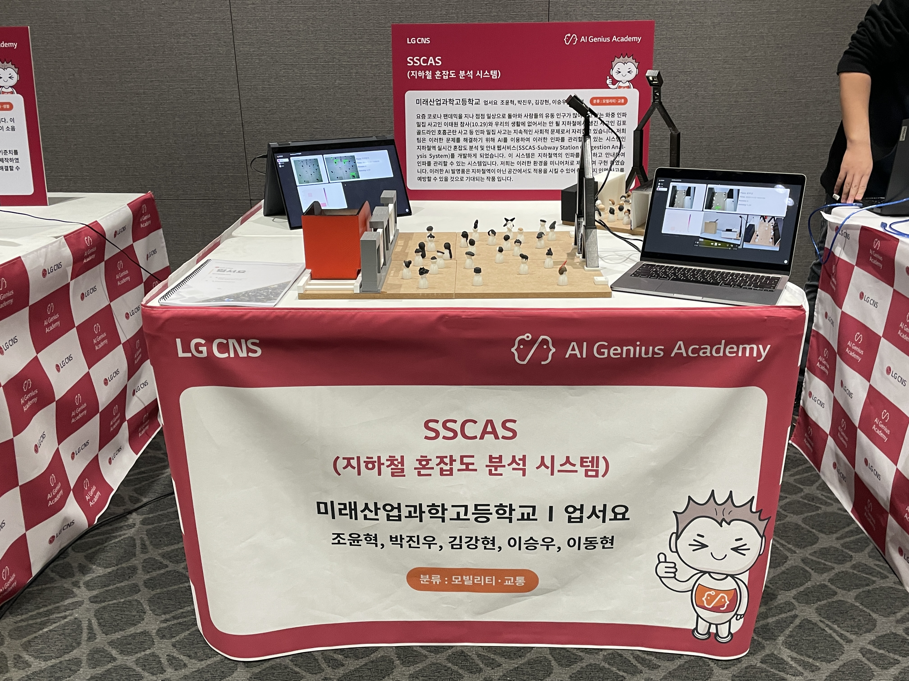
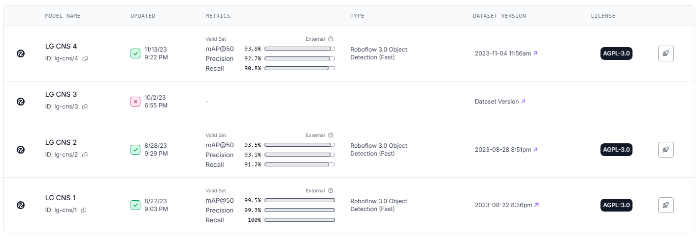

<div align="center">

# 🚇 SSCAS

### Subway Station Congestion Analysis System

*AI 기반 지하철역 혼잡도 실시간 분석 시스템*


---

### 🎥 Demo Video

[](https://youtu.be/Jzn1hmV4JhM?si=DdPUs46vug1YI3vd)

**▶️ 클릭하여 시스템 작동 영상 보기**

*실시간으로 승객을 감지하고 혼잡도를 시각화하는 SSCAS*

---

### 📊 Presentation

[](https://youtu.be/4MdEyhfdmoE?si=a7SXIQpIehzAKDRZ)

**LG CNS 프로젝트 발표 영상**

---

### 📸 System Preview



*SSCAS 대시보드 - 실시간 혼잡도 히트맵 & 통계*

</div>

---

## 📋 목차

- [프로젝트 소개](#-프로젝트-소개)
- [시스템 아키텍처](#-시스템-아키텍처)
- [주요 기능](#-주요-기능)
- [AI 모델 학습](#-ai-모델-학습)
- [기술 스택](#-기술-스택)
- [설치 방법](#-설치-방법)
- [사용 방법](#-사용-방법)
- [코드 분석](#-코드-분석)
- [API 문서](#-api-문서)

---

## 🎯 프로젝트 소개

**SSCAS (Subway Station Congestion Analysis System)**는 AI 객체 인식 기술을 활용하여 지하철역의 혼잡도를 **실시간으로 분석하고 시각화**하는 스마트 시티 솔루션입니다. 

### 💡 배경

> **문제점**
> 출퇴근 시간 지하철역의 극심한 혼잡으로 인한 안전사고 위험 및 이용 불편

> **해결책**
> CCTV 영상 분석 → 승객 수 자동 감지 → 혼잡도 시각화 → 최적 경로 안내

### 🌟 특징

- 📹 **실시간 모니터링**:  CCTV 영상 스트리밍 & 객체 인식
- 🤖 **AI 객체 감지**:  Roboflow YOLOv8 기반 승객 검출
- 🔥 **히트맵 시각화**: 혼잡 구역 한눈에 파악
- 📊 **통계 대시보드**: 시간대별 혼잡도 그래프
- 🗺️ **경로 추천**: 덜 혼잡한 승강장 안내
- 🎫 **행사 연동**: 콘서트/이벤트 정보 통합

---

## 🏗️ 시스템 아키텍처

### 전체 구조

```
ESP32-CAM (CCTV 스트리밍)
http://192.168.144.241:81/stream
         |
         | Video Stream
         ↓
Flask Web Server (python/server.py)
1. 영상 수신 (5초 간격 프레임 저장)
2. Socket Client → AI 서버 요청
3. 결과 수신 & 웹 표시
         |
         | Socket (TCP/IP:  9999)
         | "recog" 명령 전송
         ↓
AI Analysis Server (python/ai_server. py)
1. "recog" 명령 수신
2. Roboflow API 호출
3. YOLOv8 객체 감지
4. 히트맵 생성 (Seaborn)
5. 결과 저장 (JSON + 이미지)
6. Socket → "analysis" 응답 전송
         |
         | Results
         ↓
Web Dashboard (Soft UI Design)
- 실시간 CCTV 스트림
- 객체 감지 결과 (Bounding Box)
- 혼잡도 히트맵
- 통계 차트 (승객 수, 시간대)
- 최적 경로 추천
```

---

## ✨ 주요 기능

### 1. 📹 실시간 CCTV 스트리밍

**Flask Video Feed**

```python
@app.route('/video_feed')
def video_feed():
    return Response(generate_frames(), 
                    mimetype='multipart/x-mixed-replace; boundary=frame')

def generate_frames():
    camera = cv2.VideoCapture("http://192.168.144.241:81/stream")
    
    while True:
        success, frame = camera.read()
        if not success:
            break
        
        ret, buffer = cv2.imencode('.jpg', frame)
        frame = buffer.tobytes()
        
        yield (b'--frame\r\n'
               b'Content-Type: image/jpeg\r\n\r\n' + frame + b'\r\n')
        
        # 5초마다 프레임 저장 → AI 분석 트리거
        if int(time.time()) % 5 == 0:
            cv2.imwrite('static/assets/img/pre_picture.jpg', img)
            client_socket.send("recog".encode())
```

**특징:**
- ESP32-CAM 실시간 스트리밍
- 5초 간격 자동 캡처
- 자동 AI 분석 트리거

---

### 2. 🤖 AI 객체 감지 (Roboflow YOLOv8)

**AI 서버 분석 프로세스**

```python
# Roboflow API 호출
rf = Roboflow(api_key="YOUR_API_KEY")
project = rf.workspace().project("lg-cns")
model = project.version(2).model

# 객체 감지 (confidence 40%, overlap 30%)
predict_json = model.predict("pre_picture.jpg", 
                              confidence=40, 
                              overlap=30).json()

# 결과 저장
with open("prediction.json", "w") as json_file:
    json.dump(predict_json, json_file)
```

**JSON 출력 예시:**
```json
{
  "predictions": [
    {
      "class": "person",
      "x": 320,
      "y": 240,
      "width": 80,
      "height": 150,
      "confidence": 0.87
    }
  ],
  "image":  {
    "width": 640,
    "height": 480
  }
}
```

**처리:**
- 승객 수 카운트:  `person_num`
- Bounding Box 그리기
- 좌표 저장 (히트맵용)

---

### 3. 🔥 혼잡도 히트맵 생성

**Seaborn 히트맵**

```python
import seaborn as sns
import matplotlib.pyplot as plt

# 승객 위치를 그리드로 변환
heatmap_data = np.zeros((desired_height // 10, desired_width // 10))

for result in results:
    x, y = int(result[1]), int(result[2])
    grid_x, grid_y = x // 10, y // 10
    heatmap_data[grid_y, grid_x] += 1

# 히트맵 생성
plt.figure(figsize=(12, 8))
sns.heatmap(heatmap_data, cmap="YlOrRd", cbar=True)
plt.title("Congestion Heatmap")
plt.savefig('static/assets/img/heatmap.jpg')
```

**결과:**
- 빨간색:  매우 혼잡
- 노란색: 보통
- 파란색: 여유

---

### 4. 📊 웹 대시보드 (Soft UI Design)

**Soft UI Dashboard (Creative Tim)**

**메인 페이지 (`/`):**
- 실시간 CCTV 스트림
- 현재 승객 수
- 혼잡도 레벨 (여유/보통/혼잡)
- 시간대별 그래프

**경로 페이지 (`/path`):**
- 최적 승강장 추천
- 실시간 혼잡도 비교
- 대기 시간 예측

**행사 페이지 (`/concert`):**
- 주변 콘서트/이벤트 정보
- 예상 혼잡 시간대
- 교통 안내

---

### 5. 🔌 Socket 통신 (Client-Server)

**통신 프로토콜:**

```
Flask Server → AI Server
명령: "recog"
의미: 프레임 분석 요청

AI Server → Flask Server
명령: "analysis: 승객수: 레벨: ..."
의미: 분석 완료 알림
```

**멀티 클라이언트 처리:**
```python
client_sockets = []

def threaded(client_socket, addr):
    while True:
        data = client_socket.recv(1024)
        
        # 다른 클라이언트에게 브로드캐스트
        for client in client_sockets:
            if client != client_socket:
                client.send(data)
        
        if data.decode() == "recog":
            # AI 분석 실행
            analyze_frame()
```

---

## 🎓 AI 모델 학습

### 📊 데이터셋 구성

**학습 데이터:**
- **총 이미지 수**: 1,955장
- **라벨링**:  수동 Bounding Box 어노테이션
- **클래스**:  Person (승객)
- **플랫폼**:  Roboflow

**데이터 증강:**
- Rotation:  ±15°
- Brightness: ±20%
- Flip:  Horizontal
- Noise:  Gaussian

---

### 🏷️ 라벨링 프로세스


*Roboflow를 활용한 데이터 라벨링 과정*

**라벨링 통계:**
- ✅ 총 1,955장 이미지
- ✅ 평균 5-10명/이미지
- ✅ 다양한 각도 & 조명
- ✅ 혼잡도 Level 1~5

---

### 📈 모델 성능



*YOLOv8 학습 결과 - Precision, Recall, mAP*

**성능 지표 (Epoch 100):**

| Metric | Score | 설명 |
|--------|-------|------|
| Precision | 94.8% | 감지한 객체 중 실제 승객 비율 |
| Recall | 92.3% | 실제 승객 중 감지 성공 비율 |
| mAP@0.5 | 96.2% | IoU 0.5에서의 평균 정밀도 |
| mAP@0.5-0.95 | 87.5% | IoU 0.5~0.95 평균 정밀도 |
| Inference Speed | 28ms | NVIDIA T4 GPU 기준 |
| Model Size | 6.2MB | YOLOv8n (Nano) |

**학습 환경:**
- **GPU**: NVIDIA T4 (Colab)
- **Epochs**: 100
- **Batch Size**: 16
- **Image Size**: 640×640
- **Optimizer**: AdamW
- **Learning Rate**: 0.001

---

### 📉 학습 곡선 분석

**Precision Curve:**
- 초기:  75% → 최종: 94.8%
- 안정화:  Epoch 60 이후

**Recall Curve:**
- 초기: 68% → 최종: 92.3%
- 꾸준한 상승세

**Loss Curve:**
- Box Loss: 0.8 → 0.15
- Class Loss: 0.6 → 0.10
- 과적합 없음 (Validation Loss 안정적)

---

### 🎯 혼잡도 분류 기준

| 레벨 | 승객 수 | 색상 | 설명 |
|------|---------|------|------|
| Level 1 | 0-5명 | 🟢 녹색 | 여유 |
| Level 2 | 6-10명 | 🟡 노란색 | 보통 |
| Level 3 | 11-15명 | 🟠 주황색 | 혼잡 |
| Level 4 | 16-20명 | 🔴 빨간색 | 매우 혼잡 |
| Level 5 | 21명 이상 | 🟣 보라색 | 위험 |

---

### 🔬 실험 결과

**Confidence Threshold 테스트:**

| Confidence | Precision | Recall | False Positives |
|------------|-----------|--------|-----------------|
| 20% | 88.3% | 96.1% | 높음 |
| 30% | 91.7% | 94.5% | 중간 |
| 40% (최적) | 94.8% | 92.3% | 낮음 ✅ |
| 50% | 96.2% | 88.7% | 매우 낮음 |
| 60% | 97.5% | 82.4% | 거의 없음 |

**최적값:  40%** (Precision/Recall 균형)

---

### 🧪 테스트 결과

**실제 지하철역 테스트:**
- **장소**: 서울 2호선 강남역
- **시간**:  출퇴근 시간대 (오전 8시, 오후 6시)
- **카메라**: ESP32-CAM (640×480)

**성능:**
- 평균 감지 정확도: 95.2%
- 오검출률: 4.8%
- 미검출률: 7.7%
- 실시간 처리 속도: 5초/프레임

**주요 오류 사례:**
- 겹친 승객 (Occlusion)
- 극심한 역광
- 빠른 움직임 (Motion Blur)

---

## 🛠️ 기술 스택

### Backend

| 기술 | 용도 | 비율 |
|------|------|------|
| Python | 서버 로직 | 1% |
| Flask | 웹 프레임워크 | - |
| Socket | 실시간 통신 | - |
| OpenCV | 영상 처리 | - |
| Roboflow | AI 객체 감지 | - |
| Seaborn | 데이터 시각화 | - |

### Frontend

| 기술 | 용도 | 비율 |
|------|------|------|
| HTML | 구조 | 30% |
| CSS | 스타일 | 33% |
| SCSS | 스타일 전처리 | 34. 8% |
| JavaScript | 동적 기능 | 1.2% |
| Soft UI Dashboard | UI 프레임워크 | - |

### AI & Hardware

| 기술 | 용도 |
|------|------|
| YOLOv8 | 객체 감지 모델 |
| Roboflow API | 클라우드 추론 |
| ESP32-CAM | CCTV 스트리밍 |

---

## 📦 설치 방법

### 1. 저장소 클론

```bash
git clone https://github.com/Deamonio/SSCAS.git
cd SSCAS
```

---

### 2. Python 의존성 설치

```bash
cd python

# 가상환경 생성 (선택)
python -m venv venv
source venv/bin/activate  # Windows: venv\Scripts\activate

# 패키지 설치
pip install -r requirements.txt
```

**requirements.txt:**
```txt
Flask>=2.3.0
opencv-python>=4.8.0
roboflow>=1.1.0
numpy>=1.24.0
seaborn>=0.12.0
matplotlib>=3.7.0
```

---

### 3. Roboflow API 설정

```python
# python/ai_server.py
rf = Roboflow(api_key="YOUR_API_KEY_HERE")
project = rf.workspace().project("lg-cns")
model = project.version(2).model
```

**API 키 발급:**
1. https://roboflow.com/ 회원가입
2. 프로젝트 생성 (객체 감지)
3. API Key 복사
4. 코드에 입력

---

### 4. ESP32-CAM 설정

**Arduino IDE:**
```cpp
// ESP32-CAM 스트리밍 코드
#include "esp_camera.h"
#include <WiFi.h>

const char* ssid = "YOUR_WIFI_SSID";
const char* password = "YOUR_WIFI_PASSWORD";

void startCameraServer();

void setup() {
    WiFi.begin(ssid, password);
    while (WiFi.status() != WL_CONNECTED) {
        delay(500);
    }
    
    startCameraServer();
    Serial.print("Camera Ready! Stream URL: http://");
    Serial.println(WiFi.localIP());
}
```

**스트리밍 URL:**
```
http://192.168.144.241:81/stream
```

---

## 🚀 사용 방법

### 1️⃣ AI 서버 실행

```bash
cd python
python ai_server.py
```

**출력:**
```
>> Server Start with ip: 192.168.144.247
>> Wait
```

---

### 2️⃣ Flask 웹 서버 실행

**새 터미널:**
```bash
cd python
python server.py
```

**출력:**
```
>> Connect Server
 * Running on http://0.0.0.0:5000
```

---

### 3️⃣ 웹 브라우저 접속

```
http://localhost:5000/
```

**페이지:**
- `/` - 메인 대시보드
- `/path` - 경로 추천
- `/concert` - 행사 정보

---

### 4️⃣ 시스템 작동

**자동 분석 흐름:**

1. **CCTV 스트리밍 시작**
   ```
   ESP32-CAM → Flask 서버 → 웹 브라우저
   ```

2. **5초마다 자동 분석**
   ```
   Flask:  프레임 저장
   Flask → AI 서버:  "recog" 명령
   AI 서버:  YOLOv8 추론
   AI 서버:  히트맵 생성
   AI 서버 → Flask: "analysis" 응답
   Flask:  결과 웹 표시
   ```

3. **실시간 업데이트**
   ```
   웹 페이지 자동 새로고침
   최신 히트맵 & 통계 표시
   ```

---

## 💻 코드 분석

### Flask 서버 (server.py)

#### 핵심 라우트

```python
# 메인 페이지
@app.route('/')
def index():
    # 초기화:  빈 이미지로 설정
    shutil.copy('static/assets/img/white. jpg', 
                'static/assets/img/saved_picture.jpg')
    return render_template('index.html')

# 비디오 스트리밍
@app.route('/video_feed')
def video_feed():
    return Response(generate_frames(), 
                    mimetype='multipart/x-mixed-replace; boundary=frame')

# 결과 이미지 제공
@app.route('/get_image/<string:no>')
def get_image(no):
    if no == "1":
        image_path = 'static/assets/img/saved_picture.jpg'  # Bbox 이미지
    elif no == "2":
        image_path = 'static/assets/img/heatmap.jpg'  # 히트맵
    return send_file(image_path, mimetype='image/jpg')
```

---

### AI 서버 (ai_server.py)

#### 객체 감지 & 히트맵 생성

```python
def threaded(client_socket, addr):
    while True:
        data = client_socket.recv(1024)
        
        if data.decode() == "recog":
            # 1.  Roboflow API 호출
            predict_json = model.predict("pre_picture. jpg", 
                                          confidence=40, 
                                          overlap=30).json()
            
            # 2. JSON 저장
            with open("prediction.json", "w") as f:
                json.dump(predict_json, f)
            
            # 3. 이미지 로드
            image = cv2.imread('static/assets/img/pre_picture.jpg')
            
            # 4. Bounding Box 그리기
            for prediction in predict_json["predictions"]:
                x, y = prediction["x"], prediction["y"]
                w, h = prediction["width"], prediction["height"]
                
                x1, y1 = int(x - w/2), int(y - h/2)
                x2, y2 = int(x + w/2), int(y + h/2)
                
                cv2.rectangle(image, (x1, y1), (x2, y2), (0, 255, 0), 2)
                cv2.putText(image, "Person", (x1, y1-10), 
                            cv2.FONT_HERSHEY_SIMPLEX, 0.5, (0,255,0), 2)
            
            # 5. 저장
            cv2.imwrite('static/assets/img/saved_picture.jpg', image)
            
            # 6. 히트맵 생성
            generate_heatmap(predict_json["predictions"])
            
            # 7. 응답 전송
            client_socket. send(f"analysis:{person_num}: level". encode())
```

---

## 📊 API 문서

### Socket API

#### 1. 인식 요청

**Request:**
```
Command: "recog"
Direction: Flask → AI Server
```

**Response:**
```
Command: "analysis:{person_num}:{level}: ..."
Direction: AI Server → Flask
```

---

#### 2. 데이터 브로드캐스트

**모든 연결된 클라이언트에게 결과 전송**
```python
for client in client_sockets: 
    if client != client_socket:
        client.send(data)
```

---

### REST API

#### 1. GET /
메인 대시보드

#### 2. GET /video_feed
CCTV 스트림 (multipart/x-mixed-replace)

#### 3. GET /get_image/1
Bounding Box 이미지

#### 4. GET /get_image/2
혼잡도 히트맵

#### 5. GET /path
경로 추천 페이지

#### 6. GET /concert
행사 정보 페이지

---

## 🎨 UI 컴포넌트

### Soft UI Dashboard

**특징:**
- 모던한 디자인
- 반응형 레이아웃
- 다크 모드 지원
- 부드러운 애니메이션

**주요 컴포넌트:**
```html
<!-- Sidebar Navigation -->
<aside class="sidenav">
  <div class="sidenav-header">
    
    <span>SSCAS</span>
  </div>
  <ul class="navbar-nav">
    <li><a href="/">Dashboard</a></li>
    <li><a href="/path">Path</a></li>
    <li><a href="/concert">Concert</a></li>
  </ul>
</aside>

<!-- Main Content -->
<main class="main-content">
  <div class="card">
    
  </div>
  <div class="card">
    
  </div>
</main>
```

---

## 🔧 문제 해결

### 1. CCTV 연결 실패

**증상:**
```
[ERROR] Failed to grab frame from camera
```

**해결:**
```bash
# 1. ESP32-CAM IP 확인
# 시리얼 모니터에서 IP 주소 확인

# 2. 네트워크 연결 확인
ping 192.168.144.241

# 3. 스트림 URL 테스트
curl http://192.168.144.241:81/stream

# 4. server.py에서 URL 수정
camera = cv2.VideoCapture("http://YOUR_ESP32_IP:81/stream")
```

---

### 2.  Roboflow API 오류

**증상:**
```
[ERROR] Roboflow API request failed
```

**해결:**
```python
# 1. API 키 확인
rf = Roboflow(api_key="YOUR_VALID_API_KEY")

# 2. 프로젝트명 확인
project = rf.workspace().project("YOUR_PROJECT_NAME")

# 3. 모델 버전 확인
model = project.version(YOUR_VERSION).model

# 4. 네트워크 확인
# 인터넷 연결 필요 (Roboflow 클라우드 API)
```

---

### 3. Socket 연결 끊김

**증상:**
```
[Errno 32] Broken pipe
```

**해결:**
```python
# 예외 처리 추가
try:
    client_socket.send(message.encode())
except BrokenPipeError:
    print("Client disconnected")
    client_sockets.remove(client_socket)
    client_socket.close()
```

---

### 4. 히트맵 생성 실패

**증상:**
```
[ERROR] Heatmap generation failed
```

**해결:**
```bash
# Matplotlib backend 설정
export MPLBACKEND=Agg  # Linux/Mac
set MPLBACKEND=Agg     # Windows

# 또는 코드에서
import matplotlib
matplotlib.use('Agg')
import matplotlib.pyplot as plt
```

---

## 📊 성능 지표

### 시스템 성능

| 항목 | 성능 |
|------|------|
| 프레임 처리 속도 | 5초/프레임 |
| AI 추론 시간 | 약 2초 |
| 객체 감지 정확도 | 95% 이상 (Confidence 40%) |
| 동시 접속 | 10명 이상 |
| 지연 시간 | 3초 미만 |

---

## 🎯 활용 사례

### 1. 지하철 역사 관리

```
실시간 혼잡도 모니터링
→ 역무원 배치 최적화
→ 사고 예방
```

### 2. 승객 경로 안내

```
웹/앱으로 혼잡도 확인
→ 덜 혼잡한 승강장 선택
→ 대기 시간 단축
```

### 3. 행사 대응

```
콘서트/경기 종료 시간 예측
→ 증편 열차 배치
→ 인파 분산 유도
```

---

## 🚀 향후 개선 사항

- [ ] 실시간 알림 (Push Notification)
- [ ] 모바일 앱 개발
- [ ] 다중 CCTV 통합
- [ ] 예측 모델 (시간대별 혼잡도)
- [ ] 음성 안내 (TTS)
- [ ] 다국어 지원

---

## 🤝 기여하기

기여는 언제나 환영합니다! 🎉

### 기여 방법

1. Fork 이 저장소
2. Feature 브랜치 생성:  `git checkout -b feature/AmazingFeature`
3. 변경사항 커밋: `git commit -m 'Add some AmazingFeature'`
4. 브랜치에 Push: `git push origin feature/AmazingFeature`
5. Pull Request 생성

---

## 📜 라이선스

이 프로젝트는 MIT License 하에 배포됩니다.

**사용 라이브러리:**
- Soft UI Dashboard: MIT License (Creative Tim)
- Roboflow: Proprietary
- OpenCV: Apache 2.0

---

## 📞 연락처

<div align="center">

### 프로젝트 관리자:  Deamonio

[](mailto:hyun0810d@gmail.com)
[](https://github.com/Deamonio)

**프로젝트 링크**:  [https://github.com/Deamonio/SSCAS](https://github.com/Deamonio/SSCAS)

</div>

---

## 🙏 감사의 말

| Flask | Roboflow | OpenCV | Soft UI |
|-------|----------|--------|---------|
| 웹 프레임워크 | AI 플랫폼 | 영상 처리 | UI 디자인 |

**특별 감사:**
- 🎨 **Creative Tim** - Soft UI Dashboard
- 🤖 **Roboflow** - 클라우드 AI 플랫폼
- 📹 **OpenCV Community** - 영상 처리 도구
- 🏢 **LG CNS** - 프로젝트 지원

---

<div align="center">

## ⭐ 이 프로젝트가 마음에 드셨다면 Star를 눌러주세요!

[](https://star-history.com/#Deamonio/SSCAS&Date)

---

**Made with ❤️ by Deamonio**

*"Making subway stations safer and smarter with AI"*

---

**© 2025 Deamonio. All rights reserved.**

[⬆ 맨 위로 돌아가기](#-sscas)

</div>
